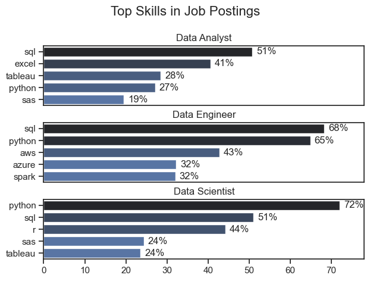
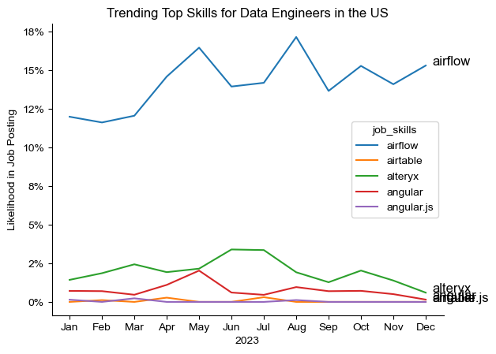
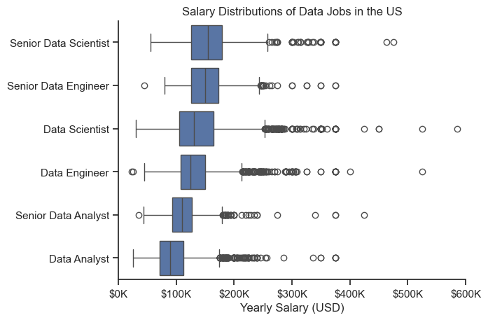

# Overview 
Welcome to my analysis of the data job market, focusing on data engineer roles. This project was created out of a desire to navigate and understand the job market more effectively. It delves into the top-paying and in-demand skills in US market to help find optimal job opportunities for data Engineering role.

The data sourced from Hugging face online platform provides a foundation for my analysis, containing detailed information on job titles, salaries, locations, and essential skills. Through a series of Python scripts, I explore key questions such as the most demanded skills, salary trends, and the intersection of demanded and salary in data analytics that I also called Optimal salary in this project. 

# The Questions
Below are the questions 1 want to answer in my project:
1. What are the skills most in demand for the top 3 most popular data roles?
2. How are in-demand skills trending for Data Engineers?
3. How well do jobs and skills pay for Data Engineers?
4. What are the optimal skills for data engineers to learn? (High Demand AND High Paying)

# Tools I Used 
For my deep dive into the data engineers job market, I harnessed the power of several key tools:

- Python: The backbone of my analysis, allowing me to analyze the data and find critical insights.I also used the following Python libraries:
 jiolgj

-     Pandas Library: This was used to analyze the data.
-     Matplotlib Library: I visualized the data.
-     Seaborn Library: Helped me create more advanced visuals.
- Jupyter Notebooks: The tool I used to run my Python scripts which let me easily include my notes and analysis.
- Visual Studio Code: My go-to for executing my Python scripts.
- Git & GitHub: Essential for version control and sharing my Python code and analysis, ensuring collaboration

# Data Preparation and Cleanup
This section outlines the steps taken to prepare thje data for analysis and cleanup, ensuring accuracy and usability 

## Import and Clean Up Data
I start by importing necessary libraries and loading the dataset, followed by initial data cleaning tasks such as correcting date to date data type from string basically correcting the data type and similar for job skills in the last part of the project converting to the list data type from string as we had list looking like string data type over there and also using pandas.notna() function to check if value isn't missing as that was associated with skill data 
# The Analysis 
Each notebook of the Jupyter in the project focuses at analysis of specific aspects of the data job market. Here's the way I approached each question:

## 1. What are the most demanded skills for the top 3 most popular data roles? 
To find the most demanded skills for the top 3 most popular dat aroles. I fildtered out those positions by which ones were the most popular, and tot the top 5 skills for these top 2 roles. This query highlights the most popular jon titles and their top skills and their top skills, showcasing which skills I should pay attention to depending on the role I am targeting 

See my notebook with steps here [2_Skill_Demand.ipynb](3_Project/2_Skill_demand.ipynb)

### Code View 
```python
df_skills_count = df_skills.groupby(['job_skills', 'job_title_short']).size()

#Doing it, it converts series to dataframe format so that it will be easy to manipulate data or in this case count data
df_skills_count = df_skills_count.reset_index(name = 'skill_count')

#Sorting the values of skill_count column in descending order
df_skills_count.sort_values(by= 'skill_count', ascending = False, inplace = True)

#Now we need to get the top 3 roles we can directly define it 
job_titles = ['Data Analyst', 'Data Engineer', 'Data Scientist']
```

### Results / Visualization



### Summary of the data via visualization

- SQL is the most requested skill for Data Analysts and Data Scientists, with it in over half the job postings for both coles. For Data Engineers. Python is the most sought-after skillen appearing in 68% of 10b postings.
- Data Engineers require more specialized technical skills (AWS, Azure. Spark) compared to Data Analysts and Data Scientists who are expected to be proficient in more general data management and analysis tools (Excel, Tableau).
- Python is the versatile skill. highly demanded across all three roles. but most prominently for Data Scientists (72%) and Data Engineers (65%) roles.

## 2. How are in-demand skills trending for Data Engineers?
To see how skills used in Data Engineering role changed throughout 2023, I focused on Data Engineer job postings and grouped the required skills by the month each job was posted. This allowed me to identify the top five skills for each month and see how their popularity shifted over the course of the year.

See my notebook with detailed steps here: [3_Skill_Trend.ipynb](3_Project/3_Skill_Trend.ipynb)

### Code View 
```python
from matplotlib.ticker import PercentFormatter

df_plot = df_DE_US_percent.iloc[:, :5]
sns.lineplot(data=df_plot, dashes=False, legend='full', palette='tab10')
sns.set_theme(style='ticks')
sns.despine() # remove top and right spines

plt.title('Trending Top Skills for Data Engineers in the US')
plt.ylabel('Likelihood in Job Posting')
plt.xlabel('2023')
plt.gca().yaxis.set_major_formatter(PercentFormatter(decimals=0))

# annotate the plot with the top 5 skills using plt.text()
for i in range(5):
    plt.text(11.2, df_plot.iloc[-1, i], df_plot.columns[i], color='black')

plt.show()
```

### Results / Visualization


### Insight from Visualization
- Airflow remains the top demanded skill throughout the year it keeps uplifting as month goes by.
- Alteryx is another skill that is not as demanded but second  demanded in this list.
- angular airtable and angular.js following the respective lead in the data engineering job market.

## 3. How well do jobs and skills pay for Data Engineer?
To identify the highest-paying roles and skills, I only got jobs in the United States and looked at their median salary. But first I looked at the salary distributions of common data jobs like Data Scientist, Data Engineer, and Data Analyst, to get an idea of which jobs are paid the most. 

View my notebook with detailed steps here: [4_Salary_analysis.ipynb](3_Project/4_Salary_analysis.ipynb)

### Code View 
```python
#Plot the top 6 job titles salary distributions using a box plot.
sns.boxplot(data=df_US_top6, x='salary_year_avg', y='job_title_short', order=job_order)
sns.set_theme(style='ticks')
sns.despine()


plt.title('Salary Distributions of Data Jobs in the US')
plt.xlabel('Yearly Salary (USD)')
plt.ylabel('')
plt.xlim(0, 600000) 
ticks_x = plt.FuncFormatter(lambda y, pos: f'${int(y/1000)}K')
plt.gca().xaxis.set_major_formatter(ticks_x)
plt.show()
```
### Visualization / Results



### Insights
  - There's a significant variation in salary ranges across different job titles. Senior Data Scientist's maximum number of salary reached to more than 500k but only few job roles had that salary most of them was was in range of 300k salary per year. This indicates highest value of salary for senior Data Scientist among all data roles.
  - Senior data engineermost position is in salary range of 200k to 300k that is great as they has advanced data skills and experience following 3rd as Data Scientist role also has highest salary requiring advanced ML skills
  -  The median salaries increase with the seniority and specialization of the roles. Senior roles (Senior Data Scientist, Senior Data Engineer  ) not only has higher median salaries but also larger differences in typical salaries, reflecting greatest skills and experience responsibilities increase.

  ## 4. What are the optimal skills for data engineers to learn? (High Demand AND High Paying)

  To identify the optimal skills for Data Engineers, I combined high-demand skills with high-paying skills. This helped me find the skills that are both frequently requested in Data Engineer job postings and linked to higher salaries. These skills can provide a good balance between job opportunities and earning potential.

  ### Visualization / Results
.png)


### Code View 
```python
# Find high-demand and high-paying skills and combine both to get the optimal sikills

df_optimal = df_DE_skills[
    (df_DE_skills['skill_percent'] > 5) &
    (df_DE_skills['median_salary'] > df_DE_skills['median_salary'].median())
]

df_optimal[['job_skills', 'skill_percent', 'median_salary']] \
    .sort_values('median_salary', ascending=False)
```

### Insights
- SQL and Python are the most in-demand skills for Data Engineers, appearing in more than 65% of the job postings. This shows that strong knowledge of SQL and Python is essential for building a career in Data Engineering.
- AWS, Spark, and Azure are also highly demanded skills and have relatively high median salaries. This indicates that cloud technologies and big-data tools can provide strong career opportunities for Data Engineers.
- The most optimal skills are those that combine high demand with higher salaries. Skills such as Python, AWS, and Spark stand out because they are frequently requested in job postings while also having strong median salaries. This makes them valuable skills for Data Engineers to learn and develop.

## Project Conclusion

This project provided practical experience in analyzing the US data job market using Python and data visualization tools. The analysis showed that SQL, Python, AWS, and Spark are highly valuable skills for Data Engineers, while senior and specialized roles offer higher salaries. Overall, the project helped identify the most in-demand, high-paying, and optimal skills for building a career in Data Engineering.